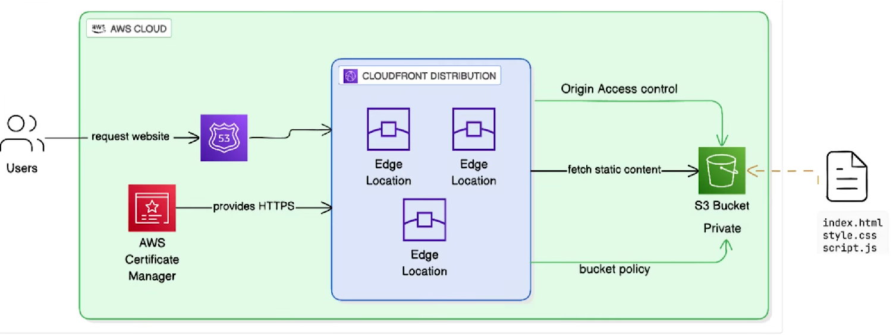
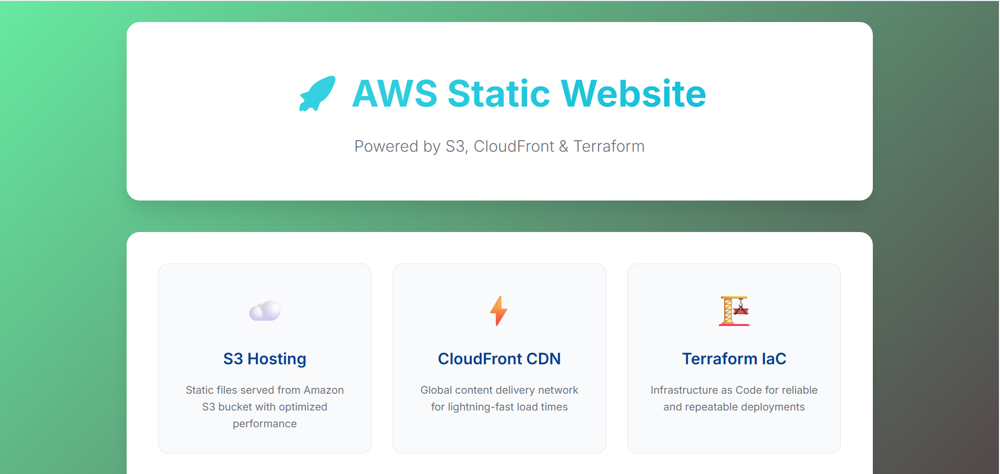

# 📄 README.md — *S3 Static Website with CloudFront (Terraform)*

# 🌐 Static Website Hosting on AWS using S3 & CloudFront (Terraform)

This project demonstrates how to host a **static website on Amazon S3** and distribute it globally using **Amazon CloudFront**, with the entire infrastructure provisioned using **Terraform (IaC)**.

The setup follows **real-world DevOps best practices** such as Infrastructure as Code, modular configuration, and secure public content delivery.

---

## 📌 Project Overview

- Static website hosted on **Amazon S3**
- Global content delivery using **Amazon CloudFront**
- Infrastructure provisioned using **Terraform**
- Public access restricted to CloudFront only
- Highly available, scalable, and cost-effective architecture

---

## 🛠️ Technologies Used

- **AWS S3** – Static website hosting  
- **AWS CloudFront** – CDN for global distribution  
- **Terraform** – Infrastructure as Code  
- **AWS IAM** – Secure access control  
- **HTML/CSS** – Static website content  

---

## 🏗️ Architecture Diagram



**Flow:**
1. User accesses website via CloudFront URL
2. CloudFront fetches content from S3 origin
3. Static files are cached at edge locations
4. Faster and secure content delivery to users

---

## 📂 Project Structure

```text
s3-cloudfront-terraform/
├── main.tf
├── variables.tf
├── outputs.tf
├── terraform.tfvars
├── website/
│   ├── index.html
│   └── error.html
└── images/
    ├── architecture.png
    └── cloudfront-output.png

```
---


## ⚙️ Terraform Resources Used

* `aws_s3_bucket`
* `aws_s3_bucket_website_configuration`
* `aws_s3_bucket_policy`
* `aws_cloudfront_distribution`
* `aws_cloudfront_origin_access_control`
* `aws_iam_policy_document`

---

## 🚀 How to Deploy

### 1️⃣ Initialize Terraform

```bash
terraform init
```

### 2️⃣ Preview Infrastructure

```bash
terraform plan
```

### 3️⃣ Apply Configuration

```bash
terraform apply
```

---

## 📤 Outputs

After successful deployment, Terraform outputs:

* **CloudFront Distribution URL**
* **S3 Bucket Name**

Example output:

```text
cloudfront_url = https://d123example.cloudfront.net
```

---

## 🌍 Application Output



Access the website using the **CloudFront URL** to view the deployed static site.

---

## 🔐 Security Best Practices Implemented

* S3 bucket is **not publicly accessible**
* Access restricted using **CloudFront Origin Access Control**
* Static content served securely via CloudFront
* No hardcoded credentials

---

## 🧠 Key Learnings

* Hosting static websites using S3
* Using CloudFront as a CDN for performance
* Managing AWS infrastructure with Terraform
* Understanding origin access and secure content delivery
* Real-world Infrastructure as Code workflow

---

## 📈 Future Enhancements

* Add **custom domain using Route 53**
* Enable **HTTPS using ACM**
* Add **cache invalidation**
* Create **Terraform modules**
* CI/CD pipeline using Jenkins or GitHub Actions

---

## 👤 Author

**Vasu Reddy**
DevOps | Terraform | AWS | Kubernetes

---